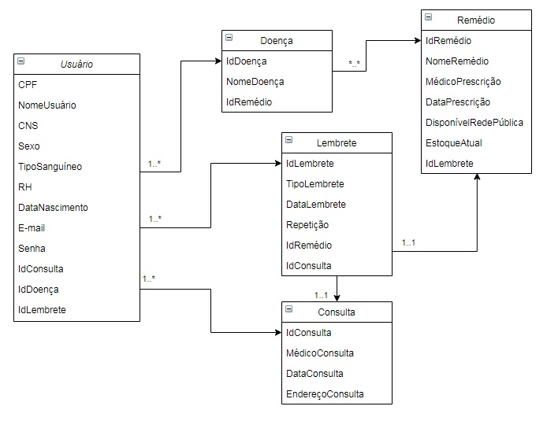

# Projeto Curae

Este projeto foi elaborado como parte do Hackathon Chiesi USP pelo grupo Ametista, composto por Elton Soligueto, Kalil Souza, Kleiton Augusto, Laíse Aquino e Vinicius Serafim.

A solução proposta é uma aplicação PWA (Progressive Web App) que auxilia os usuários a lembrar de consultas e remédios associados a doenças crônicas, além de fornecer artigos informativos relacionados as mesmas.

Modelo simplificado de entidades:

